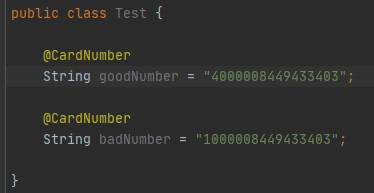
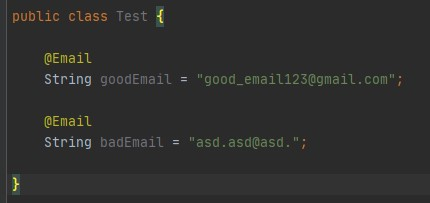
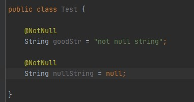
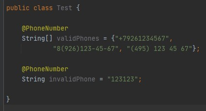
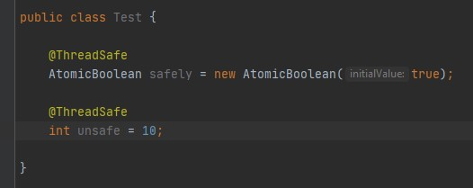
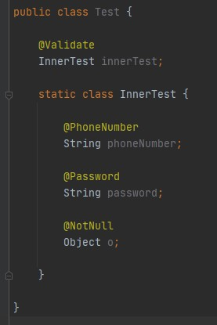

# Annotation Library

Библиотека предназначена, в первую очередь, для полей класса.

**Список доступных аннотаций:**

* @CardNumber
    * Проверяет поле, содержащее номер карточки (страховки, 
    банковской карты и т.д.) на валидность по алгоритму Луна  
    
    
* @Email 
    * Проверяет email/rambler/gmail и т.д. на валидность  
    
    
* @NotNull
    * Проверяет, что поле не пустое  
    
     
* @Password
    * Валидность пароля. Пароль считается корректным,
    когда содержит не менее восьми символов, включая как минимум
    одну цифру и одну заглавную букву, и не совпадает с такими
    распространенными паролями, как, например _"Qwerty123"_  
    
    
* @PhoneNumber
    * Проверка валидности номера по международному формату  
    
    
* @ThreadSafe
    * Эта аннотация оценивает, потокобезопасно ли поле  
    
    
* @Validate
    * Аннотация указывает, что следует проверить не только 
    само поле, но и его содержимое, если это, например,
    экземпляр какого-то класса, поля которого содержат другие
    аннотации для валидации их значений  
    
    
    
    
**Так же, можно аннотировать коллекции, массивы, карты:**
```
 @CardNumber
 List<String> numbers; 

 @NotNull
 Object[] objects;

 @ThreadSafe(mapTarget = MapTarget.KEYS, threadTarget = ThreadTarget.ALL)
 volatile Map<String, Integer> map;

```
В листинге кода можно увидеть [mapTarget](src/main/java/com/nastenkapusechka/validation/util/MapTarget.java)
и [threadTarget](src/main/java/com/nastenkapusechka/validation/util/ThreadTarget.java) - это перечисления-метки;  
первые используются для того, чтобы указать аннотации (если вы вдруг пометили карту), 
что следует проверять - ключи, или значения, вторые же используются
для того, чтобы указать аннотации, проверяющей коллекцию, карту или массив - следует проверять лишь сам массив/коллекцию/карту, 
или каждый его элемент включительно.(Относится только к аннотации @ThreadSafe)  
>По умолчанию mapTarget и threadTarget стоят MapTarget.UNKNOWN и 
>ThreadTarget.ONLY_FIELD  


*Настоятельно рекомендуем использовать тип String для полей*
    
    
#### Небольшой туториал : how to use Annotation Library

Создадим класс:
```
class Test {...}
```
Допишем ему поля и развесим на них аннотации:
```
    @NotNull
    Object[] objects;
    
    @Password
    String password;
    
    @PhoneNumber
    List<String> phoneNumbers;

public Test(String password, List<String> phoneNumbers, Object... objects) {
        
        this.objects = objects;
        this.password = password;
        this.phoneNumbers = phoneNumbers;
        
    }
```
Для того, чтобы получить результаты валидации этих полей, следует применить
один-единственный метод `validate(Object o)` и передать в его параметр
экземпляр этого класса:
```
class Main {
    public static void main(String[] args) {

        Test test = new Test("Qwerty123",
                new ArrayList<>(Arrays.asList("8-926-123-45-67", "123-45-67")),
                "not null obj", null, "some str");

        Validator.validate(test);

    }
}
```
**Если что-то пойдет не так, компилятор выбросит исключение:**
```
Exception in thread "main" java.lang.NullPointerException: Field: objects element #2 is null
```

Вот и все) 


[Здесь](javadocs) представлена документация  
А [здесь](javadocs/overview-summary.html) можно перейти на главную
страницу документации
